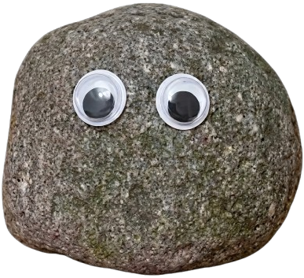
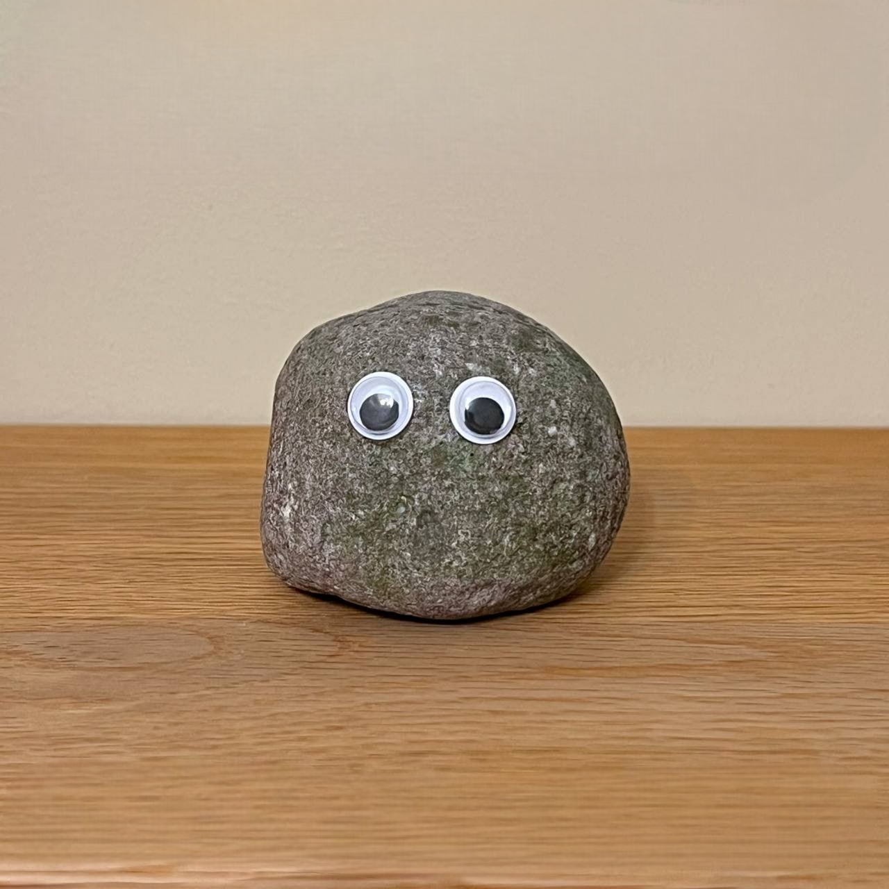
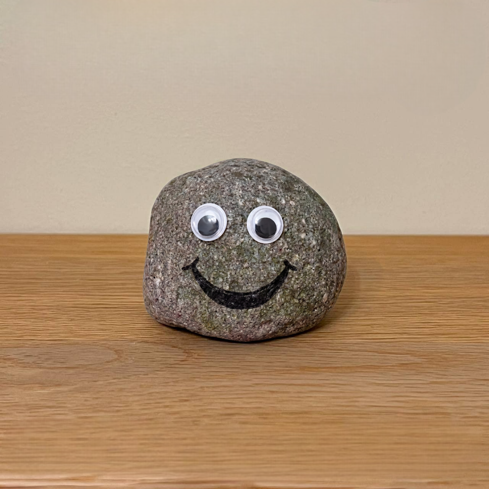
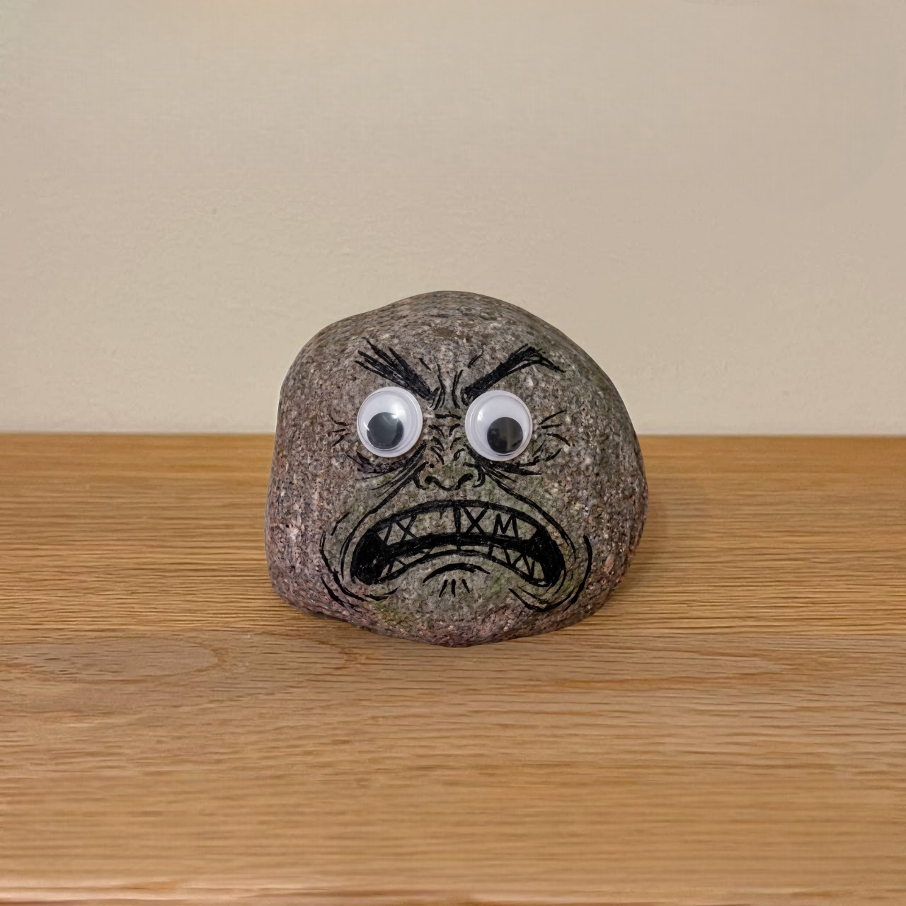
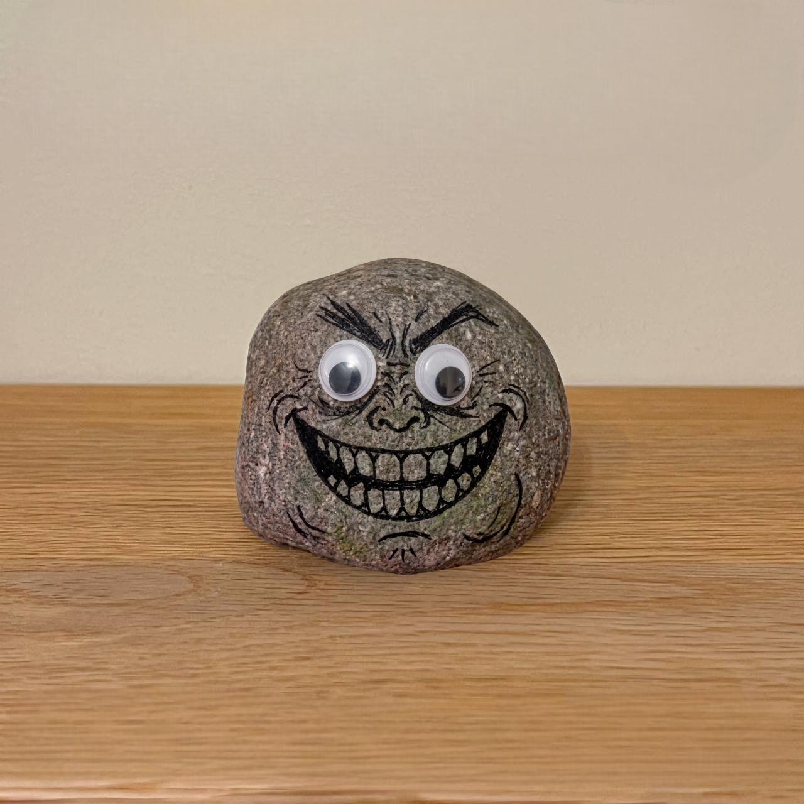

<div align="center">

# 🪨 $ROCKY

### **The Hardest Meme on the Internet**

*Not a dog. Not a frog. Just a rock.*



[](https://nextjs.org/)
[](https://react.dev/)
[](https://www.typescriptlang.org/)
[](https://tailwindcss.com/)
[](https://gsap.com/)

---

**A legendary stone that rolled out of nowhere and became the strongest community on chain.**

[🌐 Live Site](#) · [🐦 Twitter](#) · [💬 Telegram](#) · [📊 Chart](#)

</div>

---

## 🏔️ About

**$ROCKY** is a community-driven meme token built around the most iconic rock on the internet. This repository contains the official $ROCKY website — a premium, animated, scroll-driven web experience showcasing the token's story, roadmap, and meme culture.

---

## ✨ Features

| Feature | Description |
|---|---|
| 🎬 **Cinematic Hero** | Full-bleed hero section with parallax sky background, animated text reveals, and stone-themed UI |
| 📖 **Lore Section** | Scroll-over-fixed-hero storytelling with spotlight mouse-tracking text effect and googly-eye Rocky |
| 🗺️ **Rockmap** | Horizontal-scroll roadmap with GSAP-powered panel snapping, animated gemstone GIFs, and stone slab phase cards |
| 😎 **Meme Generator** | Built-in meme creator with 10 Rocky expressions, live text overlay preview, and one-click canvas download |
| 🖱️ **Custom Cursor** | Stone-themed custom cursor that follows the mouse across the entire site |
| ⚡ **Loading Screen** | Branded loading animation before content reveal |

---

## 🪨 Meme Generator

Create and download $ROCKY memes instantly — choose from **10 expressions**, add top & bottom text, and hit generate.

| Expression | Preview |
|---|---|
| 😐 Neutral | 😊 Happy |
| 😠 Angry | 😢 Sad |
| 🤩 Excited | 😍 Love |
| 😱 Shocked | 😨 Scared |
| 🤢 Disgusted | 😈 Troll |

<div align="center">




</div>

---

## 🗺️ Rockmap Phases

| Phase | Gemstone | Milestones |
|---|---|---|
| **Phase 1** | 💚 Emerald | Community launch, token distribution, website V1 |
| **Phase 2** | 💙 Sapphire | NFT mint & staking, CEX applications, DAO governance |
| **Phase 3** | ❤️ Ruby | DEX listing, partnerships, NFT teasers |
| **Phase 4** | 💎 Diamond | Major CEX listing, cross-chain bridge, metaverse beta |

---

## 🛠️ Tech Stack

| Technology | Version | Purpose |
|---|---|---|
| [Next.js](https://nextjs.org/) | 16.2 | React framework with App Router & Turbopack |
| [React](https://react.dev/) | 19.2 | UI component library |
| [TypeScript](https://www.typescriptlang.org/) | 5.x | Type-safe development |
| [Tailwind CSS](https://tailwindcss.com/) | 4.x | Utility-first CSS framework |
| [GSAP](https://gsap.com/) | 3.15 | ScrollTrigger animations & horizontal scroll |
| [Framer Motion](https://www.framer.com/motion/) | 12.x | Spring-based component animations |
| [Lenis](https://lenis.darkroom.engineering/) | 1.x | Smooth scroll engine |
| [Lucide React](https://lucide.dev/) | 1.x | Icon library |

---

## 🚀 Getting Started

### Prerequisites

- **Node.js** ≥ 18
- **npm** ≥ 9

### Installation

```bash
# Clone the repository
git clone https://github.com/ayanmal1k/ROCKY.git
cd ROCKY

# Install dependencies
npm install

# Start the development server
npm run dev
```

Open [http://localhost:3000](http://localhost:3000) to view the site.

### Build for Production

```bash
npm run build
npm start
```

---

## 📁 Project Structure

```
ROCKY/
├── public/
│   ├── meme/              # 10 Rocky expression images
│   ├── rockmap/            # Gemstone GIF animations
│   ├── numpty/             # Custom Numpty font
│   ├── sky.png             # Hero & meme section background
│   ├── heroo-bg.png        # Desktop hero background
│   ├── mobile-hero-bg.png  # Mobile hero background
│   ├── lore-bg.png         # Lore/About section background
│   ├── ROCKMAP-BG.png      # Roadmap section background
│   ├── stone-slab.png      # Roadmap phase card texture
│   ├── stone-cursor.png    # Custom cursor asset
│   └── rocky.png           # Rocky mascot image
├── src/
│   ├── app/
│   │   ├── layout.tsx      # Root layout with fonts & custom cursor
│   │   ├── page.tsx        # Main page assembling all sections
│   │   └── globals.css     # Complete design system & styles
│   └── components/
│       ├── Hero.tsx         # Hero section with animated text
│       ├── About.tsx        # Lore section with spotlight effect
│       ├── Roadmap.tsx      # Horizontal scroll roadmap
│       ├── MemeGenerator.tsx # Meme creator with canvas download
│       ├── LoadingScreen.tsx # Branded loading animation
│       └── CustomCursor.tsx  # Stone cursor component
└── package.json
```

---

## 💰 Token Info

| Property | Details |
|---|---|
| **Token Name** | $ROCKY |
| **Network** | Solana |
| **Type** | Meme Token |
| **Community** | Open & Decentralized |

---

## 🎨 Design System

The site uses a custom stone-themed design language:

- **Font**: Custom "Numpty" display font for all headings
- **Text Effect**: Stone gradient clip with black stroke (`stoney-text`)
- **Buttons**: 3D bevelled stone buttons with press animations (`stone-btn`)
- **Colors**: Dark palette with gold accents (`#d4a843`) and gem-specific hues
- **Effects**: Mouse-tracking spotlight text, parallax scrolling, googly-eye physics

---

## 📄 License

This project is proprietary. All rights reserved.

---

<div align="center">

**Built with 🪨 by the $ROCKY community**

*The hardest meme on the internet. Diamond hands only.*

</div>
